# ARG_OSCI Hardware Implementation Guide

**ARG_OSCI** is an open-source portable oscilloscope platform. This document details the technical implementation of the hardware, focusing on design decisions, construction, and improvement opportunities. It is intended for engineers and advanced users interested in building or modifying the device.

---

## Table of Contents
- [Introduction](#introduction)
- [Design Overview](#design-overview)
- [Implementation Details](#implementation-details)
  - [Input Network](#1-input-network)
  - [Attenuation Networks](#2-attenuation-networks)
  - [Amplification Stage](#3-amplification-stage)
  - [Signal Filtering](#4-signal-filtering)
  - [External ADC Circuit](#5-external-adc-circuit)
  - [Transient Comparator Circuit](#6-transient-comparator-circuit)
  - [Calibration Square Wave Generator](#7-calibration-square-wave-generator)
  - [Connection Status LED Circuit](#8-connection-status-led-circuit)
  - [Power Supply](#9-power-supply)
  - [ESP32 Connectivity and Decoupling](#10-esp32-connectivity-and-decoupling)
- [Design Files and Resources](#design-files-and-resources)
- [Construction and Improvement Notes](#construction-and-improvement-notes)
  - [Assembly and Component Selection](#assembly-and-component-selection)
  - [Protection and Safety](#protection-and-safety)
  - [Optional Simplifications](#optional-simplifications)
  - [Design and Layout](#design-and-layout)
  - [PCB Design](#pcb-design)
  - [3D Case Design](#3d-case-design)
- [Pending Tasks and Recommendations](#pending-tasks-and-recommendations)
  - [Technical Improvements](#technical-improvements)
  - [Documentation and Usability](#documentation-and-usability)
  - [Future Development](#future-development)
- [License](#license)
- [Acknowledgements](#acknowledgements)

---

## Introduction

This document describes how to implement the ARG_OSCI hardware, including the rationale behind each design block, construction notes, and suggestions for further development. For usage instructions, refer to the user manual.

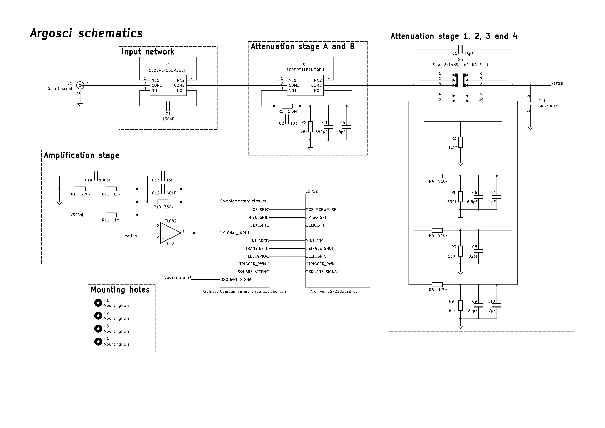
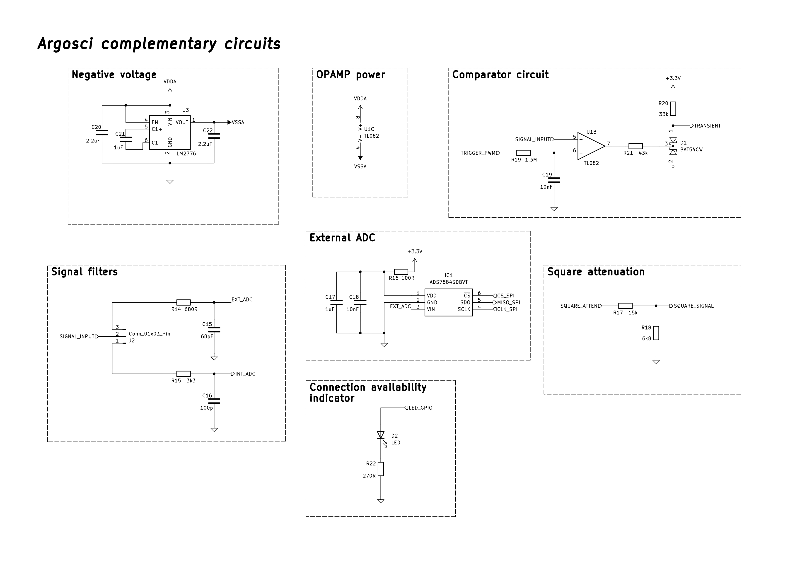
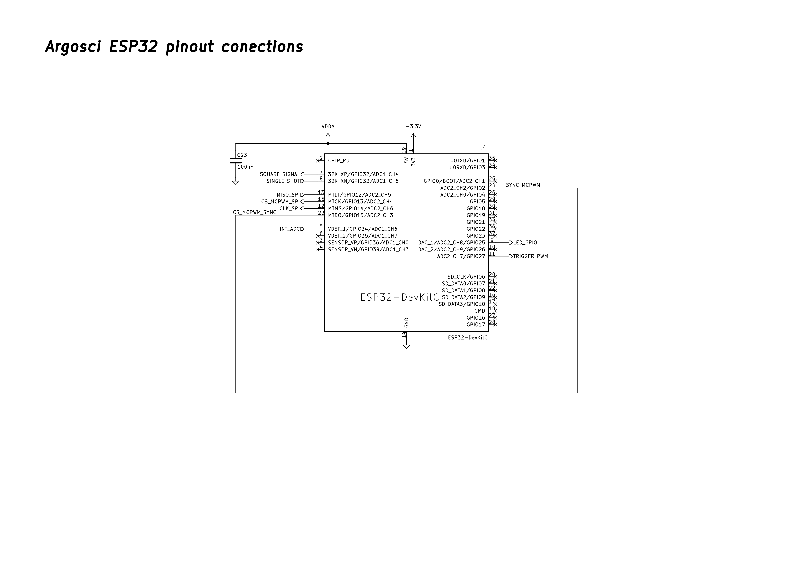

## Design Overview

The hardware is divided into several functional blocks:

- Input Network
- Attenuation Networks
- Attenuation Stage Details
- Amplification Stage
- Signal Filtering
- External ADC Circuit
- Transient Comparator Circuit
- Calibration Square Wave Generator
- Connection Status LED Circuit
- Power Supply
- ESP32 Connectivity and Decoupling

---

## Implementation Details

### 1. Input Network

The input network provides both AC and DC coupling paths. The AC coupling path includes a series capacitor (150 nF), while the DC path is direct. The 150 nF capacitor must be rated for at least 500V to safely block DC voltages up to the device's maximum scale (±400V). The capacitor value was selected to achieve a cutoff frequency below 1 Hz, considering that the input impedance is always greater than 1MΩ (typically 1070 MΩ to 1500 MΩ, depending on the attenuation setting). This configuration forms a high-pass filter and ensures accurate measurement of AC signals above 1Hz, with a settling time of approximately 1 second after switching to AC coupling.

> **Expansion note:** You may add a graph of the high-pass filter response.

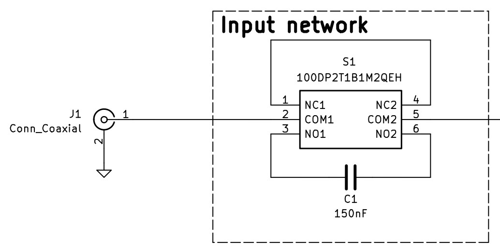

### 2. Attenuation Networks
#### A/B Attenuation Network
Provides coarse attenuation (e.g., ×40) using resistor dividers and mechanical switches (2P2T selector switch).

#### 1/2/3/4 Attenuation Network
Provides fine attenuation (e.g., ×2.4), yielding eight selectable voltage ranges in combination with the A/B network. This stage also uses mechanical switches (2P4T selector switch) and resistor divider networks for attenuation.

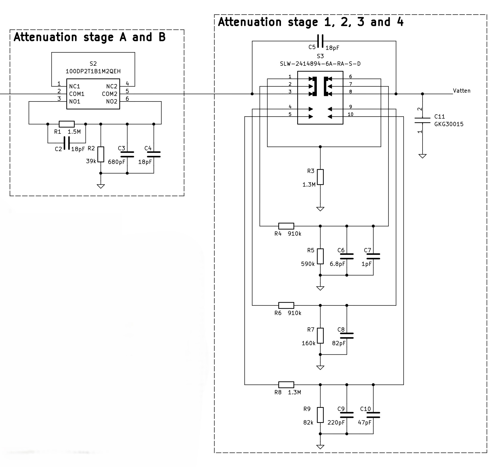

#### Attenuation Stage Details

The decision to use resistive divider networks in the attenuation stage was made after a thorough analysis of various possible configurations. Different approaches were evaluated based on criteria such as ease of compensation, the number of switches required for implementation, the impedance presented to the amplifier, and other relevant aspects. The chosen solution represents a balance between precision, simplicity, and robustness for the application.

The attenuation stage is designed to maintain an input impedance greater than 1 MΩ. To compensate for the effects of parasitic capacitances —particularly those introduced by the amplifier— capacitors are included in the attenuation network. The total input capacitance of the device is kept below 20pF. Components are selected with 5% tolerance (1% for higher precision if desired), resistors are rated at 1/4 W, and capacitors are rated for at least 25 V, except for the series capacitor in stage B, which must withstand up to 500 V to safely attenuate signals up to 400V when required.

A trimmer capacitor is placed at the amplifier input to allow fine adjustment and compensate for variations in the amplifier’s input capacitance and other component tolerances. The trimmer is adjustable up to 20pF, with a minimum value of approximately 4.2pF, ensuring a flat frequency response across the device’s bandwidth. The most sensitive stage to these variations is A2, as it has the smallest capacitance in parallel with the amplifier, making it more susceptible to frequency response deviations.

### 3. Amplification Stage

The amplification stage uses the TL082 operational amplifier, chosen for its suitable bandwidth, slew rate, operating ranges, low associated errors, low cost, and ease of sourcing. Two feedback configurations are implemented: the inverting configuration is used to set the signal offset (centering it within the ADC input range using the –5V rail), while the non-inverting configuration amplifies the measured signal to maximize the ADCs' dynamic range.

To minimize errors due to input bias currents, high-value resistors are used in the feedback network. This necessitated the inclusion of a capacitive compensation network (without the need for a trimmer in this case).

> **Expansion note:** Discuss op-amp selection criteria, possible improvements, and test results.

#### Design Considerations and Potential Improvements
- **Resistor Value Optimization:** It is being considered to reduce the values of the feedback resistors, as the error from bias currents is relatively low. Lowering these values could allow the removal of the compensation network, though a capacitor should still be retained to filter noise from the –5V supply. This change would increase the device's power consumption and should be evaluated accordingly.
- **Negative Voltage Limiter:** It is recommended to add a negative voltage limiter at the amplifier output. While the amplifier typically saturates at positive voltages (not damaging the ADCs), under certain conditions it may output voltages below 0V, which could potentially harm the ADCs.

### 4. Signal Filtering

A conventional first-order RC low-pass filter is used for signal filtering. The filters are designed based on the input capacitance of the ADCs used in each case. Two separate filter networks are implemented, allowing the user to select which ADC to use. For each network, the cutoff frequency is set to the maximum frequency that the device can accurately measure with the selected ADC.

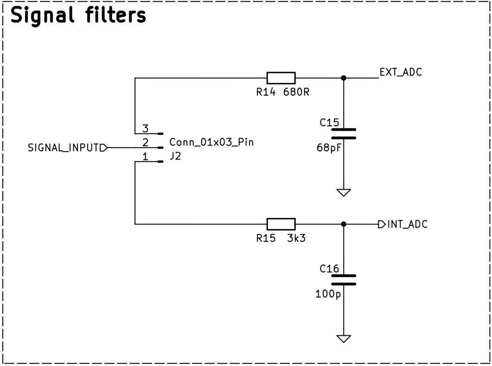

#### Design Considerations and Potential Improvements
- **Filter Effectiveness Review:** It has been observed that at higher frequencies, aliasing phenomena may occur, distorting the measured signal and its frequency spectrum. A review of the filter effectiveness is recommended, and higher-order filters may be considered to improve performance and reduce aliasing effects.

### 5. External ADC Circuit

The external ADC (ADS7884) circuit is designed following the manufacturer's recommendations. For SPI communication with the ESP32, the layout ensures physical proximity between the ADS7884 and the relevant ESP32 pins, with all SPI traces kept as short and equal in length as possible. These measures are critical to maintain signal integrity at the 40 MHz communication frequency.

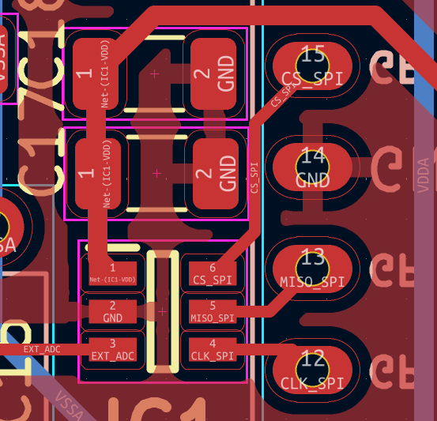

The ADS7884 is powered by the 3.3 V supply provided by the ESP32's onboard regulator, which also serves as the ADC's voltage reference. The stability of this voltage is crucial for measurement accuracy. To stabilize the supply, an RC network is implemented, consisting of the manufacturer-recommended capacitors and a 100 Ω resistor (subject to further review), in line with the recommended power supply impedance.

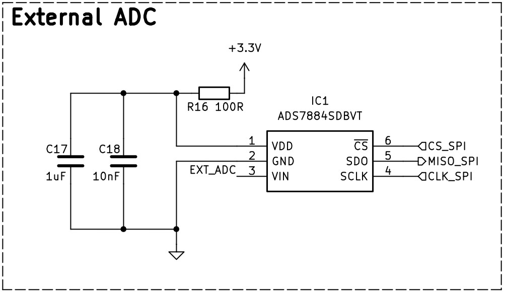

#### Design Considerations and Potential Improvements
- **Dedicated Voltage Regulator:** It is recommended to consider adding a dedicated voltage regulator for the ADC to ensure a stable reference voltage, independent of noise from the ESP32 supply.
- **Power Supply Filtering Review:** The value of the series resistor and the overall RC network should be reviewed and optimized to further improve voltage stability and measurement quality.
- **EMI/Environmental Noise Shielding:** The ADC has shown sensitivity to environmental interference and noise. It is recommended to implement shielding methods on the PCB or enclosure to reduce these effects and improve measurement reliability.

### 6. Transient Comparator Circuit

The transient comparator circuit enables the detection and reading of aperiodic (transient) signals. It consists of three main parts, each with a specific function:

#### RC Filter
The RC filter stabilizes a PWM signal generated by the ESP32. This PWM signal is set to have an average voltage equal to the trigger level selected in the application for signal visualization. The resulting DC voltage serves as the reference level for the comparator.

#### Comparator (TL082)
The remaining amplifier in the TL082 IC is configured as a comparator. It compares the measured signal to the reference voltage from the RC filter. When the input signal exceeds the trigger threshold, the comparator switches its output state. This transition is recognized as a transient event, which is then communicated to the application for display.

#### Digital Signal Adapter
The digital adapter converts the output of the comparator to voltage levels that are safe and readable by the ESP32: 3.3 V (minimum 2.475 V) for logic high and 0 V (maximum 0.825 V) for logic low. This is achieved using a BAT54 (or BAT85) diode in combination with a resistive divider, which limits current and ensures the output is pulled close to 0 V when the comparator switches to its negative output.

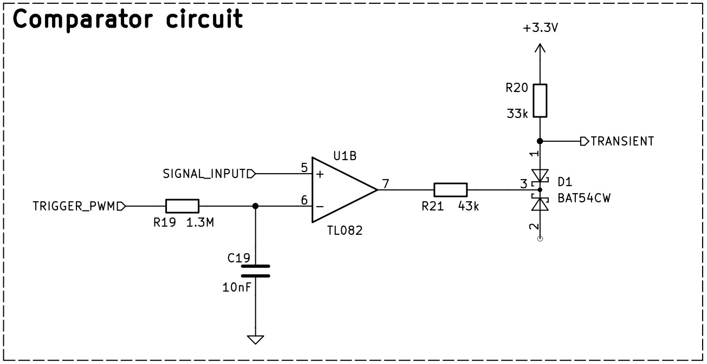

> **Expansion note:** Add timing diagrams or oscilloscope captures of transient detection events.

### 7. Calibration Square Wave Generator

The calibration circuit operates using a 1 kHz square wave signal provided by the ESP32, with levels ranging from 0 V to 3.3 V. This signal is attenuated to approximately 30% of its original amplitude using a resistive divider (15 kΩ and 6.8 kΩ), resulting in a safe level for the A2 stage, which is particularly sensitive to parasitic capacitance. The attenuated signal is used specifically to fine-tune the trimmer capacitor in the A2 stage. The resistor values are selected to minimize current draw and reduce loading on the ESP32 output.

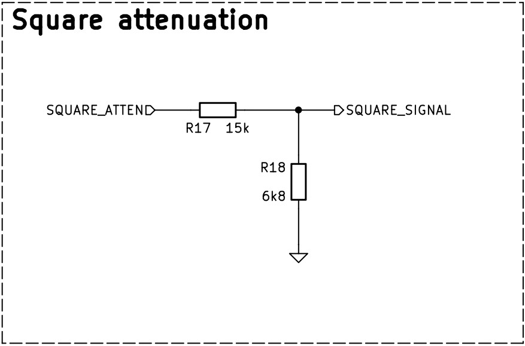

### 8. Connection Status LED Circuit

The purpose of this LED is to indicate when the ESP32 board is ready to accept WiFi connections and begin operation. While the LED is off, the device is generating the access point. When the LED turns on, it signals that the user can connect to the device.

A 5 mm LED is used to increase visibility. A 270 Ω resistor is placed in series, but this value can be adjusted if needed—for example, using a lower resistance to increase brightness. The LED size and resistor value can be modified according to specific design preferences.

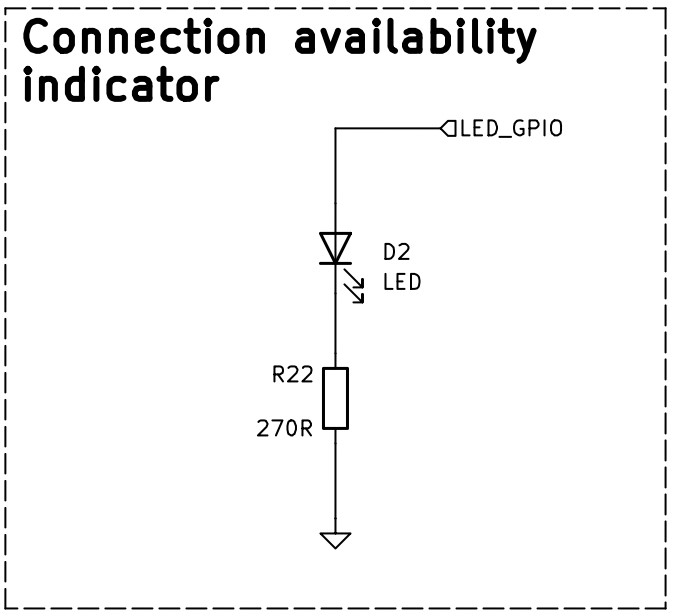

### 9. Power Supply

The power supply system is designed to provide both +5V and –5V rails required by the analog and digital circuitry:

#### +5V Supply
- The +5V supply is sourced from the ESP32's 5V pin, which itself is powered via the USB port.
- A diode-capacitor circuit is used between the USB input and the 5V rail. The presence of the diode causes a slight voltage drop below 5V. While this does not affect the operation of the operational amplifiers, it does slightly shift the voltage levels in the comparator circuit and significantly impacts the generation of the –5V rail via the LM2776.

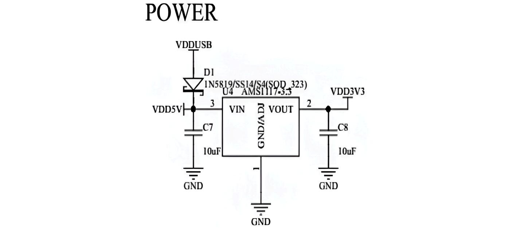
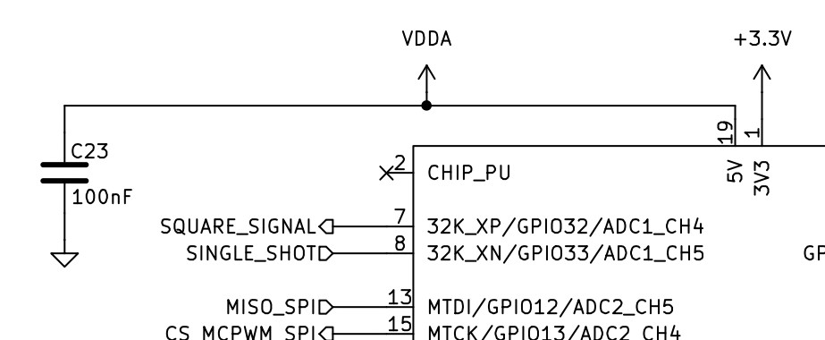

#### –5V Supply
- The –5V rail is generated using the LM2776 charge pump IC, implemented according to the manufacturer's recommendations.
- Stabilization and voltage generation capacitors are placed as close as possible to the LM2776 to ensure proper operation and minimize noise.
- Since the LM2776 inverts and slightly alters the positive supply voltage, software and firmware corrections are applied to compensate for any offset shifts that could affect ADC readings.
- There is a known issue with the LM2776 operation that requires further review to ensure reliable negative voltage generation.

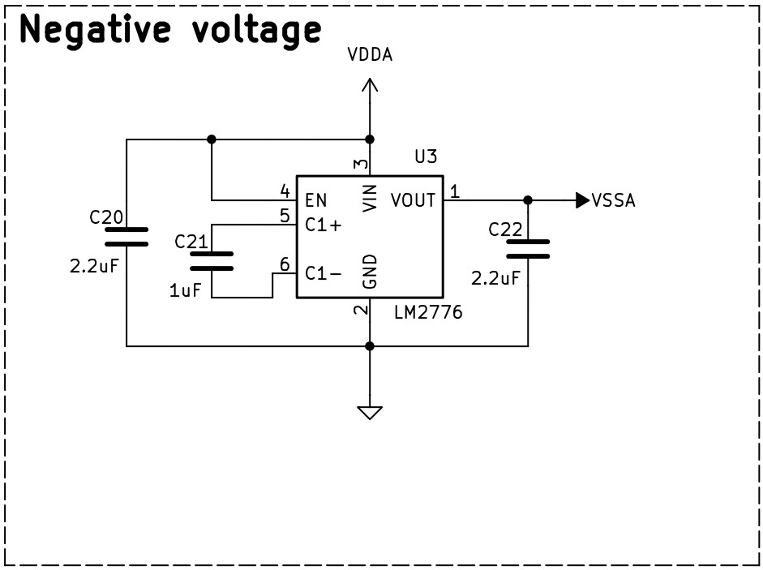

#### External Power Option
- The PCB provides access to power supply pins, allowing the circuit to be powered externally. This enables bypassing the micro USB and ESP32 for power delivery, and allows for a higher-quality negative voltage supply if needed.

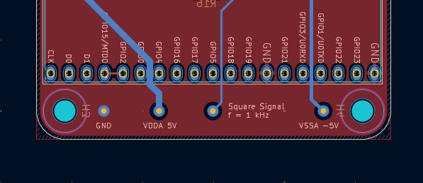

### 10. ESP32 Connectivity and Decoupling

The current design uses the Nodemcu-32s development board as the core controller. Key considerations for integrating the ESP32 with the rest of the circuit include:

- **Connection to ADS7884:** Special care is taken with the physical connection between the ESP32 and the ADS7884 ADC, as previously described. SPI traces should be as short and direct as possible to ensure reliable high-speed communication.
- **MCPWM and SPI Synchronization Pins:** The MCPWM and SPI libraries both use GPIO2 and GPIO15 for synchronization. These pins must be routed with minimal length to reduce latency and signal integrity issues.
- **Power Supply Decoupling:** A 100 nF capacitor is added at the ESP32's 5 V pin to stabilize the supply voltage used by the rest of the circuit.
- **Socketed Mounting:** The ESP32 is connected to the main board via a socket. This allows for easy removal when flashing new firmware, as the board should not be connected to the rest of the circuit during programming.

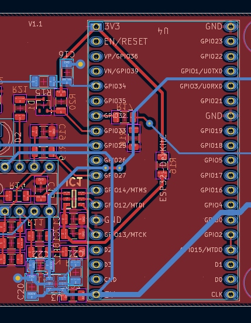

#### Future Improvements
- **Direct Microcontroller Integration:** There are plans to redesign the hardware to use only the ESP32 microcontroller chip, eliminating the full devkit. This would:
  - Reduce the overall PCB size
  - Simplify flashing and programming
  - Improve signal routing and reduce parasitic effects
  - Allow for more flexible and compact enclosure designs
  - Potentially reduce cost and improve reliability

---

## Design Files and Resources
- **Schematics**: Complete circuit diagrams for all hardware blocks. Located in the ['Schematics'](Schematics/) folder.
- **PCB Layout**: Proposed PCB design with Gerber files for manufacturing. Located in the ['PCB'](PCB/) folder.
- **BOM**: Bill of Materials with recommended part numbers and tolerances. Available in the ['BOM'](BOM/) folder.
- **3D Enclosure**: Printable STL files for the device enclosure. Available in the ['Case3D'](Case3D/) folder.
- **LTspice Simulations**: Circuit simulation files for analysis and design validation. Recommended folder name: ['LTspice_Simulations'](LTspice_Simulations/).

> **Additional files:**
- Technical documentation and manuals in the ['Doc'](Doc/) folder.
- Images and diagrams in the ['Images'](Images/) folder.

---

## Construction and Improvement Notes

### Assembly and Component Selection
- For best measurement accuracy, use 1% tolerance components in the following order of priority:
  1. Amplification circuit (affects all scales and frequencies)
  2. A/B attenuation circuit (affects upper half of scales, 40x attenuation)
  3. Series capacitor in the 1/2/3/4 attenuation circuit (affects all scales at high frequency)
  4. 1/2/3/4 attenuation circuit (affects all scales)
  5. Input filters to the ADCs
  6. Remaining components
- Both the internal ESP32 ADC and the external ADC present nonlinearities, though the external ADC is more accurate.
- Pay special attention to the correct wiring of the attenuation scales and selector logic during assembly. Errors here can damage multiple components.

### Protection and Safety
- It is strongly recommended to add fuse-varistor protection circuits to safeguard the integrity of the attenuation stages:
  - 12.5 V varistor in stage A
  - 500 V varistor in stage B
  - 5 V varistor in stage 1 (direct path to the op-amp)

Note: The current PCB does not include footprints for these components.

### Optional Simplifications
- The following stages can be omitted to reduce PCB size, simplify construction, or save on materials:
  - B attenuation stage (if high-voltage operation is not required)
  - AC/DC selection stage
  - Single-shot mode stage
  - ADC input filter for any unused ADC
- If the LM2776 IC is unavailable, substitute with a similar IC (ensure correct pinout) or provide a negative voltage rail externally.

### Design and Layout
- PCB layout can be further optimized for EMC and signal integrity.
- The enclosure design may be adapted or improved for robustness.
- More compact PCB designs are planned, including protection features and direct microcontroller integration (without the devkit).

### PCB Design
The PCB was designed following standard practices, prioritizing functional block separation and signal integrity as described in previous sections. No special layout considerations beyond those already mentioned were required.

### 3D Case Design
The 3D case was designed to fit the PCB and provide basic protection. No special design constraints or requirements were considered beyond ensuring proper fit.

> **Note:** If electromagnetic shielding is desired to reduce interference, keep in mind that the device connects via WiFi. Any shielding solution should be implemented with care to avoid degrading wireless communication performance.

---

## Pending Tasks and Recommendations

### Technical Improvements
- Complete a detailed error analysis and document the results for all acquisition paths.
- Review and improve the negative power supply design, including alternatives to the LM2776.
- Consider implementing higher-order input filters to improve signal fidelity and reduce aliasing.
- Evaluate and document the effectiveness of protection circuits and their impact on measurement reliability.

### Documentation and Usability
- Provide step-by-step assembly instructions and detailed test procedures.
- Add troubleshooting and known issues sections to assist users during assembly and operation.

### Future Development
- Develop and release more compact PCB designs with integrated protections and without the devkit.
- Explore the possibility of omitting or modularizing optional stages for different use cases.

---

## License

This hardware project is licensed under the [CERN-OHL-W v2](https://gitlab.com/ohwr/project/cernohl/-/wikis/home).

---

## Acknowledgements

This project is part of the **ARG_OSCI** oscilloscope visualization tool suite. For firmware and software, visit the [ARG_OSCI_FIRMWARE](https://github.com/ArgOsciProyect/ARG_OSCI_FIRMWARE) and [ARG_OSCI_APP](https://github.com/ArgOsciProyect/ARG_OSCI_APP) repositories.
