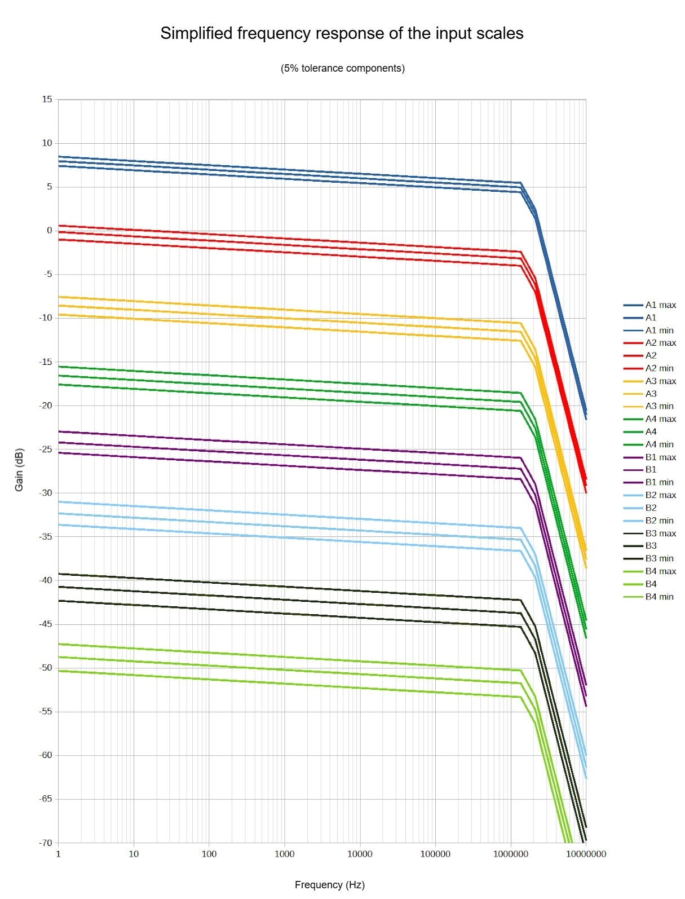
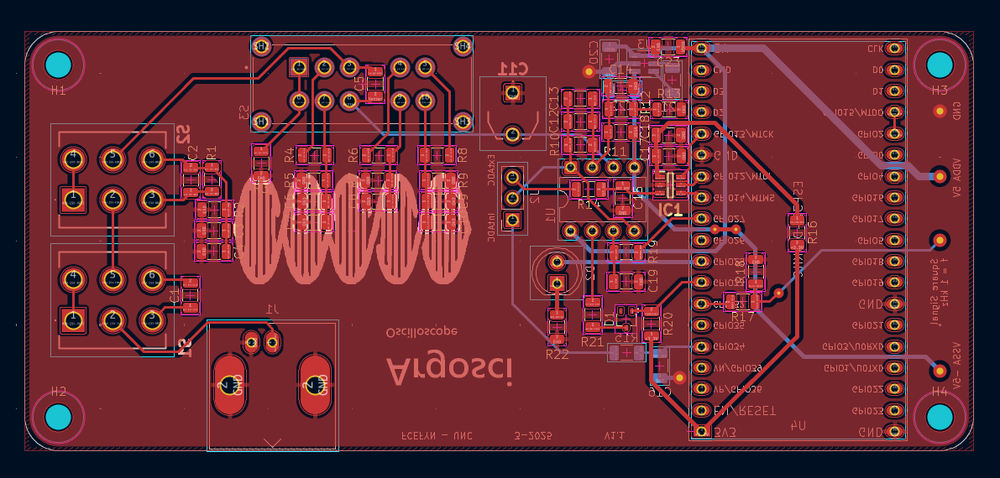
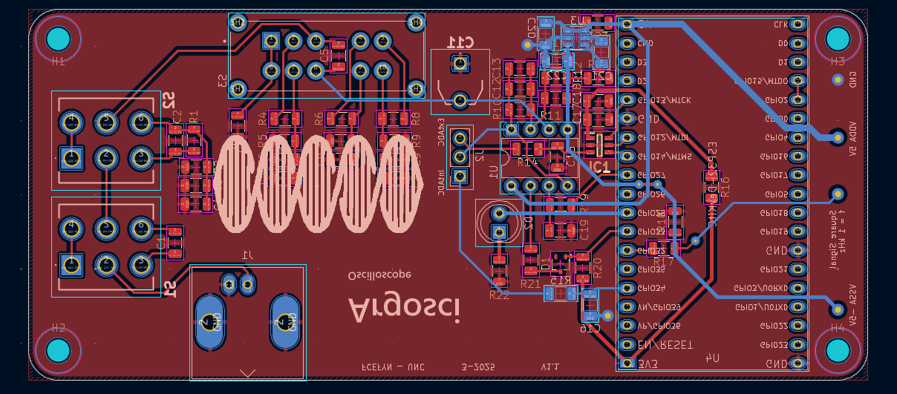
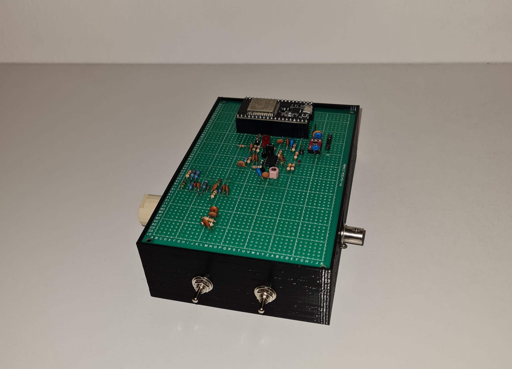
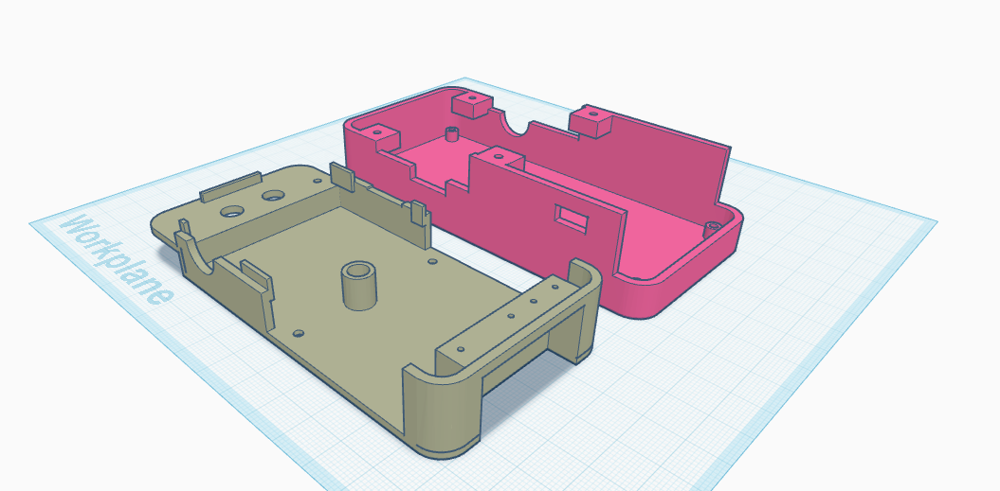

# ARG_OSCI_HARDWARE

**ARG_OSCI** is a compact and configurable digital oscilloscope platform, designed around the ESP32 microcontroller and capable of performing accurate signal measurements across a wide voltage range.  
This repository contains the complete **hardware design files** for ARG_OSCI, including schematics, PCB layout, bill of materials (BOM), and 3D enclosure models.

This repository focuses **exclusively on the hardware**.  
For firmware and companion application, see:

- [Firmware Repository](https://github.com/ArgOsciProyect/ARG_OSCI_FIRMWARE)
- [Desktop/Mobile Visualization Tool](https://github.com/ArgOsciProyect/ARG_OSCI_APP)

## Product Overview

ARG_OSCI enables reliable signal acquisition through 8 selectable voltage ranges, AC/DC coupling, internal or external ADC channels, and built-in calibration utilities. Designed for educational, prototyping, and semi-professional use, it combines ease of use with signal integrity.

**Key Features:**

- 8 voltage scales ranging from ±0.6V to ±400V
- AC/DC coupling switchable via physical toggle
- Two-stage analog attenuation network
- Internal ESP32 ADC (120 kHz BW) or external ADS7884 ADC (1.25 MHz BW)
- Anti-aliasing filters on both acquisition paths
- Built-in 1kHz test signal for compensation
- ±5V analog supply with optional external –5V input
- Physical switches for input configuration
- LED indicator for device readiness
- Designed with manufacturability and tolerance analysis in mind

## Hardware Implementation

### Voltage Scales and Attenuation Stages

Signal scaling is achieved through **two cascaded attenuation stages** controlled via mechanical switches:

- **Stage A/B**: Coarse attenuation (~×40)
- **Stage 1–4**: Fine attenuation (~×2.4)

This configuration yields 8 total scales:

| Scale | Expected Range |
|-------|----------------|
| A1    | ±0.6V          |
| A2    | ±1.5V          |
| A3    | ±4V            |
| A4    | ±10V           |
| B1    | ±24V           |
| B2    | ±60V           |
| B3    | ±150V          |
| B4    | ±400V          |

Switches allow quick manual selection of attenuation paths, providing hardware-level reliability and simplicity.

### AC/DC Coupling

Coupling mode is selected via a **physical switch**:

- **DC coupling** is the default state.
- **AC coupling** introduces a capacitor in series to block DC components.

> When switching to AC mode, start with the **highest voltage scale** to avoid damage from DC transients. After a few seconds, return to the appropriate scale for the AC signal of interest.

### Signal Conditioning and ADC Modes

ARG_OSCI supports two acquisition modes:

#### Internal ADC (ESP32):
- Integrated into the ESP32 microcontroller
- Bandwidth: ~120 kHz
- Suitable for general-purpose, low-frequency measurements
- May present non-linearities depending on configuration and reference voltage

#### External ADC (ADS7884):
- 10-bit, high-speed SAR ADC
- Bandwidth: ~1.25 MHz
- Communicates with the ESP32 via SPI
- Offers better resolution and higher fidelity
- **Placement Note**: The ADC must be physically close to the ESP32 to minimize signal degradation and ensure proper timing.

Both paths include **anti-aliasing low-pass filters** designed to suppress high-frequency noise and avoid spectral folding.

## Compensation and Calibration

A **variable capacitor (trimmer)** is used to compensate for the parasitic capacitance of the signal path and switching network. Calibration ensures a flat frequency response.

- Calibration is most effective on the **A2 scale** (±1.5V), where the system is most sensitive to capacitance variation.
- A **1kHz test signal** is built into the device for easy calibration by visualizing signal integrity.

Although other scales can be used for compensation, the limited tuning range of the trimmer may not be sufficient for high-voltage scales.

## Power Supply

- Device powered via 5V USB or external 5V supply
- –5V rail is generated internally via LM2776 inverter
- For improved accuracy and reduced offset, a stable external –5V supply may be used instead, via a dedicated header
- The –5V rail shows **sensitivity to voltage level and quality**, which may introduce noise or offset in sensitive measurements

> Power supply ripple or variation on the –5V rail can introduce baseline offset.

## Offset Correction

In case of unwanted signal offset due to analog front-end or supply variations:

1. Set the probe to the highest voltage scale.
2. Connect the input to GND.
3. Observe the measured zero level on the application.
4. Apply compensation in firmware by adjusting the ADC's midpoint reference.

The firmware exposes two calibration variables:
- **Default midpoint binary value** (e.g., 512 for 10-bit ADC)
- **Default maximum binary value** (1023 for 10-bit ADC)

To calculate the corrected midpoint:

$mid_{corrected} = mid_{default} + (max_{default} - mid_{default}) × \frac{V_{measuredZero}}{V_{scaleMax}}$

> After adjusting mid_corrected, ensure that max_corrected remains less than twice the midpoint to preserve signal range and linearity.

## Frequency Response and Expected Error

Due to component tolerances (~5%), the analog front-end may present small deviations in frequency response.

An error chart is available showing the variation of gain versus frequency for each scale.

*Simplified frequency response of the input scales*

> For higher accuracy, consider using 1% tolerance resistors and capacitors in key analog stages, especially:
> - The main amplifier circuit
> - The series capacitor in the second attenuation stage
> - The 40x attenuator in the first stage

##  Design Considerations

- Minimize trace length between ESP32 and ADS7884
- Shield analog paths where possible
- Avoid switching between scales during active sampling
- Always verify input voltage before scale selection

## Functional Behavior

- Manual selection of input scale and coupling
- Visual feedback via onboard LED when device is ready to connect
- Fixed acquisition mode (internal or external) selected at startup
- Quick calibration via built-in test signal and trimmer
- Real-time data streaming to companion software

## Known Issues & Future Improvements

### Known Issues

- Limited trimmer range limits compensation on high voltage scales
- –5V rail may introduce noise or offset if not externally regulated

### Future Improvements

- Firmware-based automatic zero-level calibration
- Modularize front-end for multi-channel acquisition
- Improve PCB layout for EMC and signal integrity

## Images

- PCB layout
  
  
  *Bot Side - PCB layout*
  
  
  *Top Side - PCB layout*
  
- Real device assembled (prototype)
  
  
  *Argosci Through-hole prototype*
  
- 3D-printed case
  
  
  *Front-Right Isometric - Argosci divided case (3D Model)*
  
  <!-- Calibration procedure -->
  <!-- Signal example on different scales // Imagen del tiempo y frecuencia -->

## License

This project is licensed under ?.
See the LICENSE file for full terms and conditions.

## Acknowledgements

This project is part of the **ARG_OSCI** oscilloscope visualization tool suite.  
For the firmware and software used, visit the [ARG_OSCI_FIRMWARE](https://github.com/ArgOsciProyect/ARG_OSCI_FIRMWARE) and [ARG_OSCI_APP](https://github.com/ArgOsciProyect/ARG_OSCI_APP) repositories.
